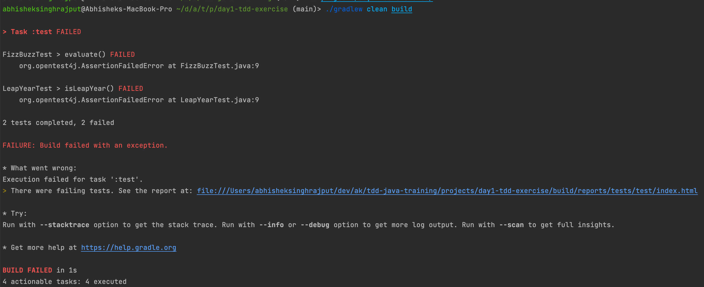

# Pre-course checklist

Check you can answer 'Yes' to the following before you attend the course.

+ Java version 17 installed  (You may use [SDKMAN](https://sdkman.io/) for installing appropriate JDK version for this exercise)
+ I can clone this repo
+ Change the dir to `tdd-java-traininig/projects/day1-tdd-exercise` and execute below command.
  ```shell
  ./gradlew clean build
  ```
  
  Expected Response:
+ 
  

## Recommended Development Environment

+ [IntelliJ Idea](https://www.jetbrains.com/idea/download/#section=mac)
+ IntelliJ Plugins:
  - [code-with-me](https://www.jetbrains.com/code-with-me/)
